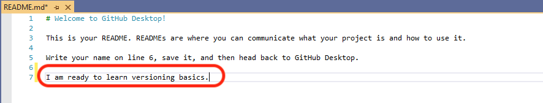
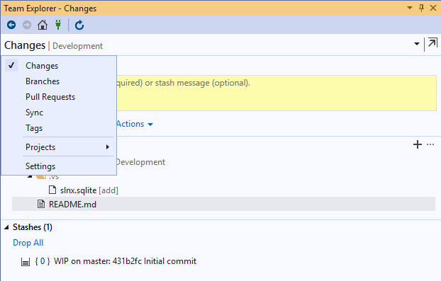
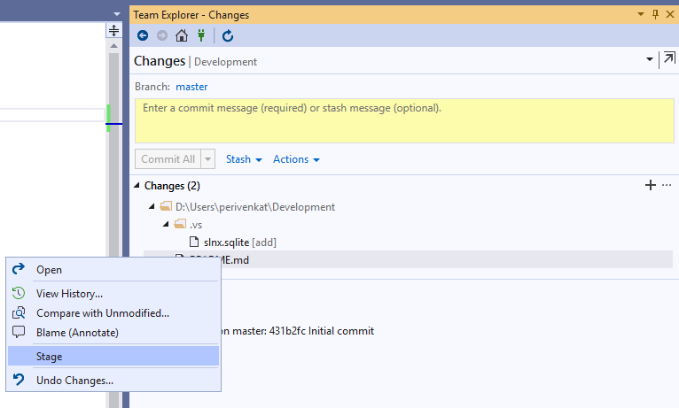
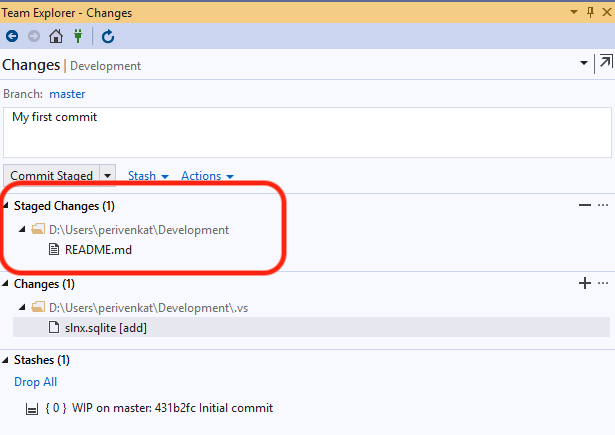

Once you have the Hello World project checked out, lets go ahead and make some edits to a file and check back into the respository.

> Edit the file **README.md** by adding any text that you wish to type at the very end.
>> The resulting file could look like below 

>> 

> Now lets go ahead and try to check in the file back into the repository. Follow the steps in the Visual Stuido Editor. 

>> 1. Stage your changed files. In the "Team Explorer window" select the "changes" view by clicking on the "Development" Tab as shown bwlos
>> 
>> In the changes folder section, select the "README.md" file for staging. Right click on the file and hit stage as shown in the image.
>> 

>> 2. The "README.md" file will now appear under the "Staged Changes" folder as shown below.
>> 
>> Now lets type in a commit message so that others can see what changes you made by typing it in the text box above as show below
>> 