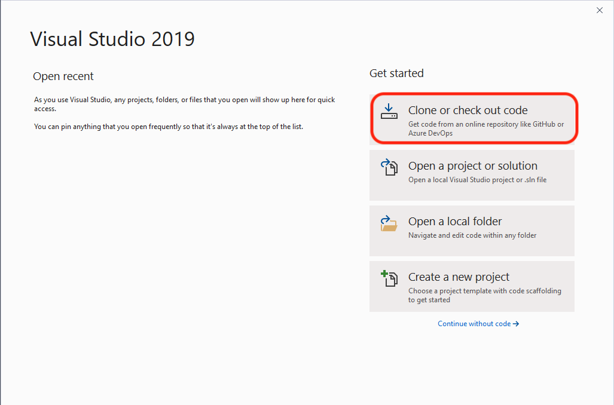
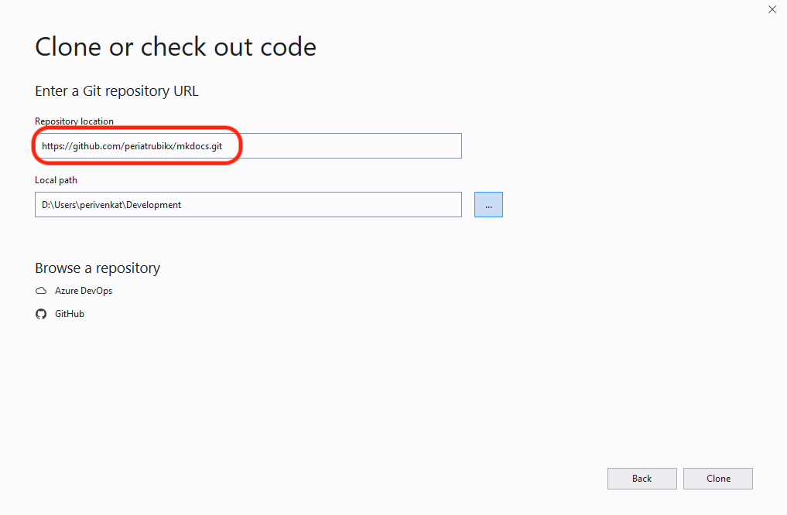
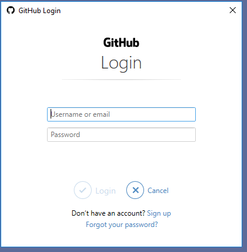
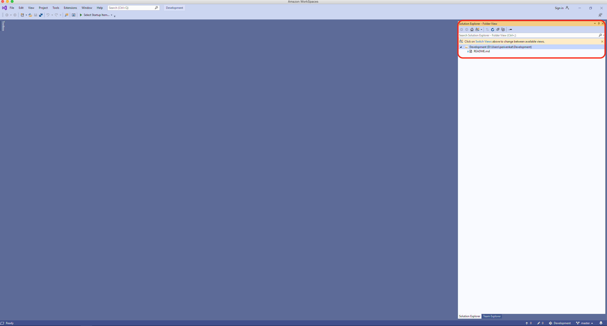

Before you try this step, ensure you have Git installed on your local system. If you haven't, please do so by following instructions [Git](versioning.md)

1. Launch Visual Studio 
2. Checkout the "Hello World" project from the RubikX Github repository by clicking the appropriate option as shown below
   > 
   
   > Next you will need to provide the repository path. Enter the following **https://github.com/periatrubikx/hello-world.git** in the repository location and provide a local path of your choosing where you would like to check out the sample project to. It should look like the image below
   
   > 
   
   > You may be prompted to enter your Github credentials if you aren't already logged into Github as shown below. If you don't have a Github account, you can create one by visiting the [Github](http://www.github.com)
   
   > 
   
   > After you are logged in, the Visual Studio will open up and you should be able to see the checked out project and the related files on the far right side of the editor as shown below.
   
   > 
   