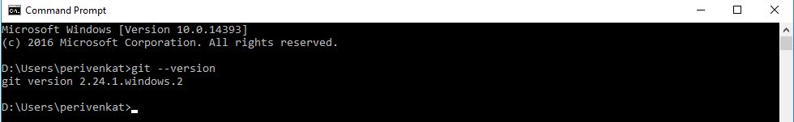

Github and Gitlab are two popular choices when it comes to version control systems and both are web based Git repositories. Good read about the similarities & differences can be found [here](https://usersnap.com/blog/gitlab-github/) .

1. Install Git on your widows machine by visiting the site below
   > https://git-scm.com/download/win
2. Verify Git was installed by typing the following command in the Command Prompt window
   > git --version
   
   >You should see the version printed on the Command Prompt as shown below.
   > 
   